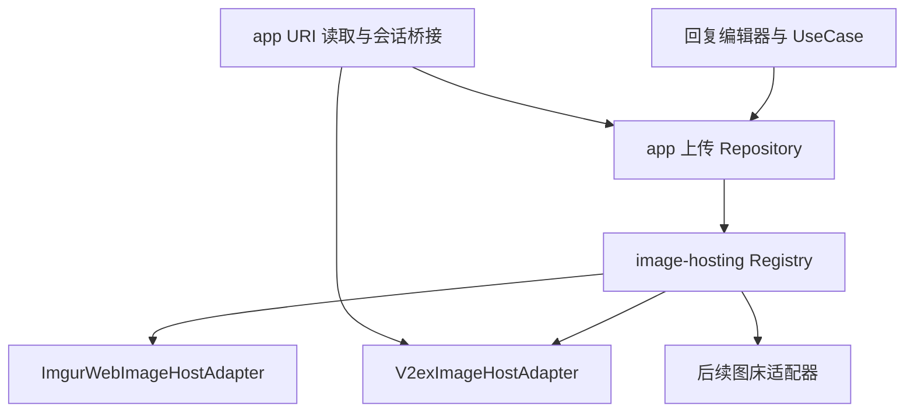

# 图床适配模块与 Imgur 网页上传设计

日期：2026-09-24  
状态：待评审；仅调研与设计，未实施。  
代码基线：`71f6cf83dd8e111a509c74a1bacecd8159f76b3d`。

## 1. 需求与设计边界

用户明确要求：

1. 单独建立图床适配模块，提供统一上传能力。
2. 现有 V2EX 图库是一个实现，保留既有行为。
3. Imgur 是另一个实现，采用匿名网页模拟上传，不采用注册应用的官方 API 接入方式。
4. 后续可以继续增加其他图床，回复编辑器不随图床增加而堆叠协议分支。

成功标准：回复编辑器选择图床和图片后，得到可展示的图片直链，插入当前光标位置并保存草稿；不同图床的会话、限制、失败处理相互隔离。增加第三种图床只需实现适配器、注册和添加展示资源，不修改编辑器上传控制流。

本文按 Superpowers `brainstorming` 的架构设计流程组织现状、备选方案、契约、异常与验收，按项目规范落在 `docs/plans/`。本次只交付设计，不执行产品实现、真实图片上传或发布。

产品默认建议：保留 V2EX 为升级后的默认图床，用户可选择 Imgur，记住上次选择；不把新增适配器静默设成默认。Imgur 不要求登录 Imgur，但暂不改变回复编辑器现有的 V2EX 登录要求。模块自身不要求 V2EX 登录，鉴权由各适配器决定。

首版不包含相册管理、OAuth、Client ID 配置、图床代理服务、动态下载插件、多图并行、视频、后台上传队列或远端删除管理。

## 2. 调研结果与证据边界

### 2.1 网页匿名上传确实存在

Imgur 官方帮助说明未登录上传为匿名、Hidden 内容，链接持有者仍可访问，Hidden 不等于私密存储。[S1]

2026-09-24 在浏览器直接访问 `https://imgur.com/upload`，观察到：

- 页面显示 Sign in / Sign up，当前没有登录 Imgur。
- 存在 “Drop images here”“Choose Photo/Video”和“Paste image or URL”。
- “My Uploads”按钮不可用。
- DOM 中存在 `input[type=file]`，`name=files`，支持多选；`accept` 包含 JPEG、PNG、GIF、APNG、TIFF、WebP 和多种视频格式。
- 页面没有 HTML `form`，普通文本抓取仅显示需要 JavaScript，说明无法按传统静态表单直接推定上传协议。

这证明当前匿名页面提供选图入口，不证明程序化上传已成功。浏览器控件的 `name=files` 也不等于网络 multipart 字段一定叫 `files`。

### 2.2 文件限制与结果转换

官方文件帮助页当前写静态图片最大 50 MB、匿名静态图片超过 1 MB 可能有损压缩、较大 GIF 可能转换为 GIFV，并说明存在上传频率限制。[S2] 这些是网站行为说明，不是 NodeFlow 必须支持的上限，也不是可写死的可用额度保证。

首版保留 NodeFlow 当前 6 MiB 安全读取上限。各适配器进一步声明自己支持的格式与大小，取两者较小值。Imgur 网页接受 WebP 的浏览器观察比帮助页格式列表更具体，但仍需要验证返回结果是否可作为图片直链使用。

匿名图片不能依赖账号图库找回；官方强调需要自行保留链接，匿名内容也不是永久保存承诺。[S3][S4]

### 2.3 尚未验证的网页协议

本次没有执行真实上传，也没有取得上传请求的网络记录。以下项目不能写成已确认事实：

| 待验证项目 | 所需证据 | 失败时处理 |
| --- | --- | --- |
| 请求 URL、方法、编码和实际字段 | 当前匿名网页成功上传的脱敏请求记录 | 不猜测历史 `/upload.json` 等路径 |
| Cookie、临时 token、CSRF 和请求头 | 同一次网页会话的准备及上传请求 | 仅按实际依赖实现，不硬编码复制旧会话 |
| 是否分为初始化、上传、完成多个请求 | 完整请求顺序和响应 | 整个流程封装在 Imgur 适配器内部 |
| 返回图片 ID、直链、展示页链接 | 成功响应及最终页面 | 不把展示页 URL 或相册 ID 当图片 |
| 删除/管理凭据是否存在 | 实际网页响应或页面提供的操作 | 没有就声明不支持，不能套用 API 的 deletehash |
| 匿名限流、验证页、登录墙、区域限制 | 目标网络中的响应/页面 | 返回对应不可用状态，不自动切换协议 |
| 动图、WebP 等转换后结果 | 小样例上传及回复展示验证 | 不支持的返回类型显式拒绝，不猜扩展名 |

用户所说“不使用 API”在本设计中指：不注册开发者应用、不调用官方 API 作为独立接入方案，而是复现当前匿名网页实际执行的流程。网页本身仍会发送 HTTP 请求，甚至可能请求带 `/api/` 的内部地址；是否可用必须以网页实际流程为准，不能仅凭 URL 名称判断。若当前网页必须使用公开 API 凭据才能脱离页面完成上传，也不能擅自改回 Client ID 方案，应记录依赖并重新评估网页执行方式。

因此本稿可以确定模块架构和行为契约，但 Imgur 的具体 wire protocol 仍是实施前置验证项。没有实测证据前不得宣称该适配器已经可用。

## 3. 现有实现

以下代码路径相对 `app/src/main/java/app/mystery0/nodeflow/`。

| 位置 | 现状 | 需要调整 |
| --- | --- | --- |
| `feature/replyeditor/ReplyEditorBottomSheet.kt` | 图片按钮、上传锁定、缩略图；清草稿文案写死 V2EX | 图床选项来自注册列表，文案图床无关 |
| `feature/replyeditor/ReplyEditorViewModel.kt` | 选图→上传→`insertImageUrl`→保存；未知结果显示 V2EX 图库入口 | 调用通用上传接口，根据结构化恢复动作展示后续操作 |
| `domain/reply/ReplyUseCases.kt`、`ReplyRepositories.kt` | `upload(contentUri)`，没有 provider 参数 | 加入稳定 `hostId`，继续保持应用层 UseCase 边界 |
| `data/reply/ImageUploadRepositoryImpl.kt` | 读取/校验后调用唯一注入的上传函数 | 通过 registry 获取适配器，应用层负责 URI 和草稿映射 |
| `data/reply/AndroidImageContentReader.kt` | 只接受 `content://`；PNG/JPEG/GIF/WebP；最多读 6 MiB + 1 字节 | 留在 app，不让 Android URI 进入通用模块 |
| `data/reply/V2exImageRemoteDataSource.kt` | GET `/i/upload` 检查权限，再以 `qqfile` 上传，解析结果 | 迁入 V2EX 适配器；保持 once-only、来源检查和登录/验证判断 |
| `core/network/NetworkModule.kt` | 默认客户端带 V2EX CookieJar、认证拦截器 | V2EX 受控注入，Imgur 独立客户端，禁止共享会话 |
| `core/database/entity/ReplyDraftEntity.kt` | 图片 ID 为主键，无 provider 字段 | 新图片命名空间 ID，兼容旧记录 |
| `core/link/ImageHostMatcher.kt` | 已支持 `i.imgur.com` | 复用识别和预览，不改成接受任意网页链接 |

`insertImageUrl` 已在当前选区插入独立一行的裸链接，直接复用。当前 `UploadUnconfirmed → OpenGallery → https://www.v2ex.com/i` 不可推广给所有图床。

## 4. 模块方案比较与选择

| 方案 | 约束效果 | 代价 | 结论 |
| --- | --- | --- | --- |
| app 内仅新增 package | 代码分区但无法阻止依赖业务模型 | 改动最少 | 不满足本次独立模块目标 |
| 一个独立 `:image-hosting` 模块，内部契约、注册表和多个适配器 | 编译期禁止依赖 app，增加适配器无需改 UI | 需要提取当前 V2EX 图片协议的边界 | 推荐 |
| 契约、每家图床、Android 桥接分别拆 Gradle 模块 | 隔离更严格，可独立发布 | 两家图床阶段增加构建和依赖管理成本 | 将来有独立发布需求再拆 |

推荐建立 Kotlin/JVM Gradle library `:image-hosting`；`app` 单向依赖它。可依赖 Coroutines、OkHttp、Jsoup 和项目版本目录中的序列化库，不依赖 Compose、Android SDK、Koin、Room 或 `app.*` 包。沿用项目 JDK/Kotlin 版本，不复制独立版本号。

建议包名 `app.mystery0.nodeflow.imagehosting`，内部分为 `contract`、`registry`、`v2ex`、`imgur`。这是编译进 APK 的适配层，不是运行时加载不受信任脚本的插件系统。



模块不依赖回复、帖子或用户主题 ID。应用层负责把通用上传结果映射为回复草稿图片，其他未来业务也可调用同一模块。

## 5. 公共契约

### 5.1 核心对象

| 类型 | 职责与关键字段 |
| --- | --- |
| `ImageHostId` | 稳定非空字符串值，例如 `v2ex`、`imgur`；不是封闭枚举 |
| `ImageHostDescriptor` | ID、显示名称、能力；UI 显示名称由 app 本地化资源覆盖 |
| `ImageHostCapabilities` | 允许 MIME、最大字节数、鉴权类型、是否支持进度；不宣称所有图床都有删除/相册 |
| `UploadImage` | 通用文件名、MIME、字节内容；首版采用有界 `ByteArray`，约定只读，不暴露 Android URI |
| `UploadedImage` | `hostId`、远端 `remoteId`、图片直链、可选展示页 URL、实际 MIME、可选管理信息 |
| `UploadFailure` | `hostId`、分类、请求阶段、结果确定性、可选重试时间、恢复动作；无原始响应正文 |
| `RecoveryAction` | `None`、`SignInToHost`、`OpenHostPage`；app 将对应 host 的动作映射为实际导航 |

`UploadedImage` 的可选管理信息与公开图片信息分开，不能直接序列化进入 Compose 状态或日志；匿名网页没有提供删除凭据时为空。公共契约不出现 `once`、`qqfile`、`sid`、`deletehash` 或特定图床响应 JSON。

接口形态（用于说明边界，非本次已实现代码）：

```kotlin
interface ImageHostAdapter {
    val descriptor: ImageHostDescriptor
    suspend fun upload(image: UploadImage): UploadResult
}

interface ImageHostRegistry {
    fun descriptors(): List<ImageHostDescriptor>
    fun find(id: ImageHostId): ImageHostAdapter?
}
```

首版采用不确定进度加载状态，不设计虚假的上传百分比。后续确需进度时通过独立事件契约扩充，不把某家图床的轮询对象返回给编辑器。

### 5.2 注册与扩展

app 作为 composition root，通过 Koin 构造各适配器并向 registry 注入列表；模块内部不绑定 Koin。注册时校验 ID 唯一，重复 ID 直接报配置错误。查找缺失 ID 返回可识别的 `HostUnavailable`，不默默改传到另一家。

编辑器图床列表来自 descriptor，不以 `when(hostId)` 编写上传逻辑。新增图床允许修改一次注册列表和 UI 名称资源，但不得修改通用接口的每个调用方，也不要求新实现提供与 V2EX 相同的图库和登录流程。

### 5.3 错误契约

通用错误分类包括：`UnsupportedType`、`FileTooLarge`、`UnreadableFile`、`AuthenticationRequired`、`PermissionDenied`、`RateLimited`、`QuotaExceeded`、`InteractionRequired`、`ProtocolChanged`、`Network`、`Server`、`HostUnavailable`。

另设结果确定性 `NotSubmitted`、`Rejected`、`Unknown`，不要用单一“失败”隐藏已经可能成功的上传。所有适配器透传 `CancellationException`。取消不能表示“服务器没有收到图片”。

登录动作按 host 归属：只有 V2EX 的 `AuthenticationRequired` 才触发现有 V2EX 登录；Imgur 网页出现登录墙时应报告匿名方式不可用，不能清除 V2EX 会话。

## 6. V2EX 适配器迁移

`V2exImageHostAdapter` 迁移现有图片上传职责，保留：

- 请求上传页，检查最终来源、路径、登录和访问验证状态。
- 以现有 `qqfile` 和一次性 multipart 上传。
- 解析成功图片、权限、额度和无法确认结果。
- 不确定结果附带 V2EX 图库恢复动作。

模块不能引用现有 `V2exWriteApi`、`V2exHtmlParser` 或领域结果类型。实施时：

1. 在模块中定义窄的图片网页请求接口或直接使用注入的 OkHttp 客户端，图片请求端点定义在适配器内，其他回复/感谢接口留在 app。
2. 提取 `parseImageUploadPage` 和 `parseImageUploadResponse` 所需的图片专用解析逻辑及测试到模块，删除旧图片专用重复实现。
3. 共用的 V2EX 登录/挑战页识别暂通过窄的 `V2exPageAccessClassifier` 接口注入，由 app 桥接已有分类器；模块中不复制整套分类规则，也不向公共图床契约泄漏 V2EX 语义。
4. app 注入现有 V2EX 写客户端及其会话依赖，模块只能使用传入的 V2EX 客户端，不能自行寻找全局登录态。
5. 旧 `V2exImageRemoteDataSource` 在调用方完成迁移后删除，不长期保留两条上传链路。

避免把整个 HTML Parser、认证、会话数据库或网络层一起搬入模块。测试先锁定旧行为，再迁移，确保模块化本身不改变用户上传体验。

## 7. Imgur 网页适配器

### 7.1 网页协议模拟方式

推荐原生 HTTP 复现当前匿名网页上传流程，由 `ImgurWebImageHostAdapter` 私有实现：

1. **准备网页会话**：访问实际匿名入口，使用独立 CookieJar，识别正常上传页、网络错误、登录墙和验证页面。
2. **提取请求上下文**：仅提取实测证明必需的临时信息；若由页面脚本生成且无法在普通 HTTP 流程取得，返回 `InteractionRequired`，不伪造有效 token。
3. **校验并发送**：按已捕获协议构造请求，使用正确 Origin/Referer；上传地址及返回媒体地址必须满足适配器自己的主机白名单，不任意跟随页面提供的跨域地址发送 Cookie 或图片。
4. **完成与解析**：若网页有多阶段完成请求，在同一次 adapter 调用中完成；解析远端 ID 与图片直链，验证实际媒体类型。
5. **返回通用结果**：成功数据、确定失败或结果不明，不把网页响应结构传到 Repository/UI。

不在方案中编造 endpoint、字段、Cookie 名称或签名算法；这些必须由下述协议调查补齐。内部解析失败统一归为 `ProtocolChanged`，并区分文件发送前后。

### 7.2 原生 HTTP 与 WebView 的取舍

| 方式 | 适用情形 | 本稿定位 |
| --- | --- | --- |
| 原生 HTTP 模拟网页请求 | 当前网页协议可通过正常会话重现 | 首选；易测试、取消、隔离 |
| 可见 WebView 运行网页 | 网页必须执行复杂脚本或用户交互 | 若实测证明必需，另行补充交互、Cookie 隔离与结果提取设计；首版不默认加入 |
| 外部浏览器手动上传后粘贴直链 | 用户需要自行完成网页操作 | 明确的手动回退，不算适配器自动上传成功 |

验证页不自动绕过；遇到网站要求用户操作时提供明确提示。外部浏览器与 OkHttp 会话不共享，不能声称“去浏览器验证后即可自动恢复原请求”。若无法在已选方案下稳定完成网页上传，只禁用 Imgur 自动上传，不退回用户已排除的官方 API 方案。

### 7.3 会话与网络隔离

- 独立创建 Imgur OkHttpClient，不能从默认 V2EX 客户端 `newBuilder()`；不带 V2EX CookieJar、AuthInterceptor、Token 或访问错误处理。
- 首版匿名 Cookie 仅保存在该适配器专属内存会话，应用重启重新建立；不导入浏览器登录 Cookie。
- 网页会话的准备及上传串行化，避免 token 被并发任务覆盖；等待锁时必须支持协程取消。
- 上传请求禁用自动重试和非预期重定向。准备页 GET 可有限重试，但文件发送后不自动从头重放整个流程。
- 初始建议连接 15 秒、写 60 秒、读 30 秒、总上传流程 90 秒；多阶段共享总 deadline，避免每一步重新累计长超时。
- 不记录 Cookie、临时 token、原始 HTML、文件内容或完整响应。错误日志仅包含 provider、阶段、状态码和脱敏分类。

### 7.4 协议验证清单

实施前使用无隐私的小样例，经正常网页流程获取并脱敏记录：

- 初始页面、选图后到完成页的完整请求次序、方法、主机、路径、字段和内容类型。
- 会话初始化、Cookie/token 生命周期、是否依赖页面脚本运行；删除真实值，fixture 使用人工替换值。
- 成功返回、普通失败、限流、验证页和结构变化的检测依据。
- 原始文件与最终链接的区别，是否产生 GIFV/视频，直链在 V2EX 回复中的展示情况。
- Android OkHttp 在目标网络下能否重现；网页能操作不等于原生 HTTP 必然成功。

这一步只验证网页协议，不注册 Imgur 开发者应用。结果单独记录到 `docs/investigations/2026-09-24-imgur-web-upload.md` 并更新索引；没有实际证据前不创建一份声称协议已验证的调查报告。

## 8. 应用层接入、草稿及兼容

### 8.1 选择与上传流程

普通 DataStore 增加 `reply_image_host`，保存 registry 的稳定 ID，默认 `v2ex`。未知/被移除的 ID 在 UI 中提示并要求重新选择，不把已选文件静默发送到默认图床。

点击插图前显示当前图床。选择 Imgur 时明确告知图片发送到该第三方、链接可访问、清草稿不会删除图片。选图取消不创建任务。

app 上传 Repository 固定本次 hostId，查询能力，使用 `AndroidImageContentReader` 有界读取并校验，然后调用 adapter。模块再次校验输入，防止其他调用者绕过限制。MIME、文件签名和返回类型校验分别承担输入与输出责任，不仅相信扩展名。

首版应用上限为 6 MiB；适配器可以更小。PNG/JPEG/GIF/WebP 取应用支持集合与适配器已验证集合的交集。没有验证通过的格式不列入该图床可用能力。不会悄悄将动图转成静态图；返回 GIFV/视频但没有可用图片直链时保留可取得的公开链接供用户查看，报告图片插入未完成，不自动再次上传。

### 8.2 草稿 ID 与持久化

模块返回显式 `hostId + remoteId`，app 使用命名空间 ID 保存新图片，例如 `imgur:<id>`、`v2ex:<id>`。旧 V2EX ID 仍按 legacy V2EX 解释，不批量重写已有草稿。新增和去重时先规范化身份，避免同一个 V2EX ID 的旧/新格式造成重复。

现有 `UploadedReplyImage`/Room 字段可以保留，将 provider 通过兼容 codec 从 ID 读取；所有调用者使用 codec，不在各处自行拆字符串。图片 URL 始终以返回并校验后的链接为准，不能根据 ID 猜扩展名。若远端没有图片 ID，adapter 产生稳定 opaque ID 并保留真实直链，不能让公共契约依赖每家都有相同 ID 结构。

本设计不要求 Room schema 变更。如实施时决定增加显式 provider 列，应补充该决策、schema 与迁移测试，不能破坏性清库。

网页若提供可用管理凭据，app 使用独立加密回执存储按 provider 分区保存；未提供时允许为空。管理信息不进入草稿 UI；存储不随清草稿、发布回复、退出 V2EX 或普通缓存清理而删除。首版不提供删除管理，不假设匿名网页一定支持 API 的 deletehash。

公网上传和本地落盘无法原子提交：已有直链时本地保存失败不能触发重传，应保留链接并报告保存失败；进程在服务端成功、收到响应前死亡时可能留下找不回的图片，不能承诺恢复所有匿名上传。

### 8.3 生命周期与并发

保留一次只上传一张。上传期间禁止编辑正文、再次选图、切换图床、发布和清草稿；UI 与 ViewModel 都检查，补上现有 `ClearConfirmed` 的在途保护。

每次请求绑定 requestId、hostId、topicId 和编辑版本。关闭 BottomSheet 不取消仍存活的 ViewModel 任务；离开详情导致 ViewModel 清理时取消。回调只写入对应且仍有效的草稿，不能复活已清空内容。取消、断网、进程恢复均不自动重新上传。

现有文件读取的 `catch(Throwable)` 需要先透传 `CancellationException`。相应行为改动必须补充测试。

## 9. 失败与恢复

| 情况 | 结果确定性 | 用户行为 |
| --- | --- | --- |
| 格式、大小、文件读取错误 | NotSubmitted | 重新选图 |
| 网页准备失败/协议改变 | NotSubmitted | 稍后重试或主动换图床 |
| V2EX 明确要求登录 | Rejected 或 NotSubmitted，按阶段 | 打开现有 V2EX 登录 |
| Imgur 出现登录墙/人机验证 | 发送前 NotSubmitted，发送后 Unknown | 告知网页模式需要交互，可打开网页手动处理，不跳 V2EX 登录 |
| 明确额度不足/429 | Rejected | 显示额度/限流及可用等待时间，不自动重试 |
| 发送后断网、超时、响应解析失败 | Unknown | 提示可能已上传；V2EX 可查看图库，Imgur 仅提供实际支持的恢复操作 |
| 成功但图片格式不适合插入 | 已上传但插入未完成 | 保留可取得链接，不重传 |
| 成功但本地保存失败 | 已上传 | 保留直链，提示本地保存失败 |

所有情况下不自动改传其他图床。将“清除草稿不会删除已上传到 V2EX 图库的图片”改为图床无关文案。`OpenGallery` 改为带 host/action 的应用层事件，模块不自行启动浏览器。

## 10. 实施顺序与测试

### 阶段 A：契约与 V2EX 迁移

- 在 `settings.gradle.kts` 注册 `:image-hosting`，建立版本目录依赖及契约/registry。
- 提取 V2EX 图片解析和请求逻辑，保留既有页面分类桥接。
- app 以 V2EX adapter 接回原流程，先证明迁移前后行为一致。
- 测试 registry 重复/未知 ID、能力校验、取消传播、登录/额度/验证页、来源检查和不自动重放。

### 阶段 B：Imgur 网页验证与实现

- 完成第 7.4 节的实际协议调查，再填写端点、编码、会话与响应 parser。
- 用脱敏 fixture 和 MockWebServer 覆盖准备→上传→完成，禁止测试访问真实网站。
- 验证不会向 Imgur 发送 V2EX Cookie，也不会向任意重定向目标发送图片。
- 对结构变化返回 `ProtocolChanged`；发送后的不确定响应不得当作安全失败自动重试。

### 阶段 C：选择与草稿

- provider 设置、能力驱动选图、首次提示、结构化恢复动作。
- 回归光标插入、旧草稿、跨图床同 ID、混合图片、持久化失败、关闭重开及过期回调。
- 用测试专用第三个 adapter 验证注册后即可显示并上传，不改编辑器控制流。
- 复用并调整 `ImageUploadRepositoryImplTest`、`ImageContentReaderTest`、`ReplyEditorViewModelTest`、`ReplyEditorTextTest`、`ImageHostMatcherTest` 及编辑器设备测试。

### 构建与设备验证

本需求涉及 Gradle、网络与共享契约，实施后执行新模块 JVM 测试、全量 `:app:testDebugUnitTest` 和 `:app:assembleDebug`；按[测试矩阵](../development/testing.md)执行必要 Lint/设备检查。仅当改变 Room schema 才增加对应迁移与真实数据库测试。

设备验收覆盖：V2EX 原流程、Imgur 匿名网页方式、JPEG/PNG/GIF/WebP 实际输出、V2EX 发帖后的图片展示、上传/图片各自域名可达性、网络断开、取消、旋转、退出页面、进程恢复及暗色模式/无障碍文案。

本次仅文档，执行 diff、相对链接、命名与一致性检查，不运行 Android 构建。后续实施完成后再更新长期的架构、网络、存储和 Agent 模块说明，不在现行说明中提前宣称项目已经多模块化。

## 11. 设计状态与上线条件

已确定的用户要求是独立适配模块、V2EX 与 Imgur 两个实现、Imgur 网页模拟和可继续扩展。

本稿给出的默认设计是一个 Kotlin/JVM Gradle 模块、原生 HTTP 网页模拟、registry 注册、旧默认 V2EX、6 MiB 应用上限及首版无删除管理。这些可在评审中调整。

唯一尚不能据此直接编码的外部协议部分，是 Imgur 当前网页请求与会话细节。本次已确认匿名选图页面，未完成真实上传验证；实施前必须取得第 7.4 节证据。若原生 HTTP 不能复现，应先补充可见网页交互方案，不能用官方 API 替代用户要求或伪称已实现。

## 12. 参考资料

访问日期：2026-09-24。

- S1：[Imgur Post Privacy Settings](https://help.imgur.com/hc/en-us/articles/26480452090779-Post-Privacy-Settings)：匿名与 Hidden 语义。
- S2：[Imgur What files can I upload? Is there a size limit?](https://help.imgur.com/hc/en-us/articles/26511665959579-What-files-can-I-upload-Is-there-a-size-limit)：格式、转换、大小及频率说明；实际能力以接入测试为准。
- S3：[Imgur How to locate an image URL](https://help.imgur.com/hc/en-us/articles/28865654408347-How-to-locate-an-image-URL)：匿名链接保存的重要性。
- S4：[Imgur Terms of Service Update](https://help.imgur.com/hc/en-us/articles/26479362527771-Imgur-Terms-of-Service-Update)：匿名内容保留限制。
- S5：[Imgur Upload](https://imgur.com/upload)：本次浏览器观察的匿名选图页面；未完成上传。
- [项目文档规范](../development/documentation.md)、[网络与认证](../subsystems/network-auth.md)、[存储说明](../subsystems/storage.md)、[现有回复创建设计](2026-07-18-v2ex-create-reply-design.md)。
